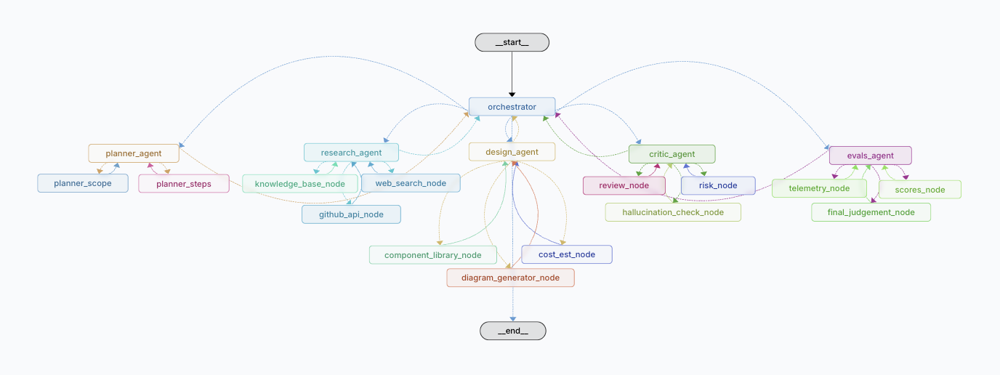

# System Design Agent (LangGraph + FastAPI + Next.js)

Build and run a system-design assistant that converts a use case prompt into a concrete **multi-agent architecture blueprint**. The backend is a **LangGraph-orchestrated** pipeline; the web app renders the blueprint primarily **visually (ReactFlow)** plus a small set of essential specifications.

## What’s in this repo
- **`apps/backend`**: Python backend (FastAPI + LangGraph pipeline + Supabase JWT auth + Postgres checkpointer/store).
- **`apps/web`**: Next.js UI (Supabase auth, optional Stripe billing hooks).
- **`supabase/migrations`**: Database schema/migrations for Supabase/Postgres.

## Quickstart (local development)
### Prerequisites
- **Python**: 3.12+ recommended
- **Node**: recent LTS + **pnpm**
- **Postgres**: a database URL for backend persistence (Supabase Postgres works)

### 1) Configure environment variables
- **Backend**: copy `apps/backend/env.example` → `apps/backend/.env`
- **Web**: copy `apps/web/env.local.example` → `apps/web/.env.local`

### 2) Install dependencies
- **Backend**:
  - `cd apps/backend`
  - `python -m venv .venv && source .venv/bin/activate`
  - `pip install -r requirements.txt`
- **Web (monorepo)**:
  - from repo root: `pnpm install`

### 3) Run the backend
You have two useful modes:
- **FastAPI mode (local API on `:8000`)**:
  - `cd apps/backend && make run`
  - Health endpoints: `GET /` and `GET /health/checkpointer`
- **LangGraph Studio / langgraph dev mode** (optional):
  - `cd apps/backend && langgraph dev`
  - This uses `apps/backend/langgraph.json` (graph: `system_design_agent`, env: `.env`, auth: `app.auth:auth`)

### 4) Run the web app
- `cd apps/web && pnpm dev`
- Set `NEXT_PUBLIC_BACKEND_URL` if your backend is not running at `http://localhost:8000`.

## Environment
### Required (backend)
- **`OPENAI_API_KEY`**
- **`LANGGRAPH_PG_URL`**: Postgres for LangGraph checkpointer/store and threads/runs persistence (required; the backend will fail fast if missing)

### Required (Supabase auth)
The backend validates Supabase JWTs.
- **`SUPABASE_ANON_KEY`**: used as `apikey` header when fetching JWKS
- **One of**:
  - **`SUPABASE_JWT_SECRET`** (recommended for HS256 access tokens), or
  - **JWKS** via:
    - **`SUPABASE_JWKS_URL`**, or
    - **`SUPABASE_URL`** (or `NEXT_PUBLIC_SUPABASE_URL`) so JWKS can be derived automatically

### Required (web)
- **`NEXT_PUBLIC_SUPABASE_URL`**
- **`NEXT_PUBLIC_SUPABASE_ANON_KEY`**
- **`NEXT_PUBLIC_BACKEND_URL`** (optional; defaults to `http://localhost:8000`)

### Optional
- **`SUPABASE_SERVICE_ROLE_KEY`**: server-side Supabase admin operations (webhooks/admin routes)
- **`TAVILY_API_KEY`**: enables web search enrichment
- **`GITHUB_TOKEN`**: enables GitHub enrichment
- **Stripe (web billing hooks)**: `STRIPE_SECRET_KEY`, `STRIPE_WEBHOOK_SECRET`, `STRIPE_PRICE_ID_PRO`

## Output (high level)
- The backend persists/sends a single structured object: `values.blueprint` (plus `goal` and `output`).
- The frontend Results tab renders the blueprint graph via ReactFlow and lists agents/specs.

## Deployment notes
- **Backend (FastAPI on a VM)**: deploy behind HTTPS (Caddy recommended) and ensure backend env vars are set. See `DEPLOY_DO.md`.
- **Web (Vercel)**: standard Next.js deployment; ensure env vars are set.

## More docs
- Backend auth/checkpointer specifics: `apps/backend/README.md`
- Web app notes: `apps/web/README.md`

## Production (DigitalOcean + Caddy)
This repo includes a simple MVP production setup using Docker Compose:

- `docker-compose.yml` + `Caddyfile` (TLS + WebSockets for `api.systesign.com`)
- Guardrails via env vars:
  - `RUN_CONCURRENCY_LIMIT` (default 1)
  - `RUN_DAILY_LIMIT` (default 3)
  - `RUN_TIMEOUT_SECONDS` (default 420)
  - `RUN_MAX_TOTAL_TOKENS` (default 20000)
  - `CORS_ALLOW_ORIGINS` (e.g. `https://app.systesign.com`)

For step-by-step instructions, see `DEPLOY_DO.md`.

## Contributing
PRs welcome — please keep lint/tests green (`pnpm lint`, `pnpm test`).

## License
MIT

## Support
Use GitHub Issues.

