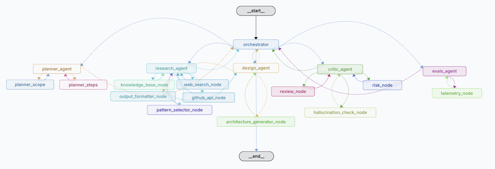

### Overview
This system is an experimental generator for multi-agent architecture blueprints, defining agent roles, tool configurations, and communication topologies using a self-correcting multi-agent orchestration pipeline. Built on LangGraph

### Problem statement
Engineers cannot reliably translate an agentic workflow idea into a correct deployable multi-agent system

### This problem is hard
Multi-agent design suffers from a high-dimensional search space: the optimal configuration of roles, tool access, and state management is highly sensitive to subtle requirement shifts. Natural language prompts are inherently underspecified for system design. Furthermore, ensuring a generated graph is technically good needs significant reasoning overhead. 

### Architecture 
**"Intake-then-Orchestrate" architecture:**
1. Iterative Intake: A dedicated agentic loop that performs single-question requirement refinement. It forces the resolution of ambiguities and identifies missing technical constraints before generation begins.
2. Multi-Agent Design Graph: A LangGraph-based orchestrator that manages specialized nodes for Planning, Research, Design, Criticism & Evals
3. Pattern-Library Mapping: The system synthesizes architectures by mapping refined goals against a formal catalog of agentic patterns (e.g., ReAct, Plan-and-Execute, Hierarchical Supervisor, Multi-Agent Debate).
4. Structured Output & Validation: The final output is a validated JSON blueprint including agent IDs, roles, toolsets, and a Mermaid-compatible topology.

### What worked
> Clarification Loop: Moving requirement gathering into a pre-generation conversational phase significantly improved the technical relevance of the generated architectures.
> Formal Pattern Injection: Utilizing a static library of agentic patterns as a grounding mechanism prevented the model from hallucinating non-functional coordination logic.
> Critic-Node Validation: Implementing a feedback loop where a critic agent scores the topology against system-design heuristics successfully filtered out "dead-end" graphs.

### What didn't
> Latency: The nature of the system using a multi-agent system to design a multi-agent system resulted in high latency, often exceeding 60 seconds per generation
> Hallucinations: the topology (edges) was often correct; the LLM occasionally failed to define the exact state-keys required for complex handoffs between agents
> Generalisation: it struggled with "cold-start" designs for highly niche domains that lacked a corresponding template in the domain catalog, defaulting to generic architectures

### LESSONS
1. Patterns > Zero-Shot: explicitly defining architectural patterns (e.g., Supervisor vs. Worker) is more reliable than asking a model to "design a system" from scratch.
2. Interface problem, there's simply not enough ways to express the processes of multi-agent systems because of their internal complexity
3. In agentic systems, the graph structure is effectively the "compiled" logic; validating edges for reachability is as important as validating the prompts within the nodes.
4. Every AI system has fundamentals, everything else is features. The industry is now in experimental mode, meaning this system will be unstable, I/O issue

## Project is frozen for the time being but pull requests and tests are welcome
